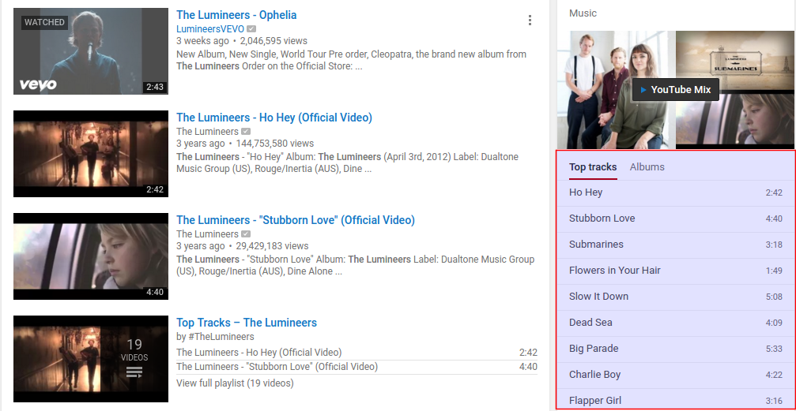

# uttop
Command line tool for downloading bands/artists top tracks from youtube

<h2>Requirements</h2>

<h3>youtube-dl</h3>
To use this tool, you must have <b><a href='https://github.com/rg3/youtube-dl'>youtube-dl</a></b> installed.

<h3>Perl Modules</h3>
You must install some Perl modules that are not usually part of the Perl core modules.
<ul>
  <li>utf8::all</li>
  <li>HTML::TreeBuilder</li>
  <li>HTML::TreeBuilder::XPath</li>
</ul>

<h3>curl</h3>
You must also have <a href="https://curl.haxx.se/">curl</a> installed.

<h2>Short Description</h2>
<b>uttop</b> uses youtube-dl, and youtube web pages, to get the top tracks for a given artist or band, and wrap it all in a folder with the audio files and a little meta-information file about the downloaded tracks [<a href="#usage">jump to usage</a>].

<h2>Long Description</h2>

I always struggle to find ways to get songs from the web, to listen offline, torrents are cool but it takes me while to find out the best one, with the best tracks from the choosen artist or band.

So, I wanted a fast util that, just giving it the artist/band, the tool would simply give me a folder with those tracks (isn't this cool?).

<h3>youtube-dl</h3>

I already had the perfect motor for download videos and extract audio installed on my system, that is <b><a href='https://github.com/rg3/youtube-dl'>youtube-dl</a></b>, so know I just needed a way to instantly get me the URLs for top tracks...

Of course <b>youtube-dl</b> has already the feature for downloading lists, so this tool is an abstraction, so that one just needs to give a name, not URLs and other stuff..

<h3>Youtube</h3>

Well, lets just say youtube take care of the top tracks...

As you probably have noticed before youtube gives you the top tracks for a given search related to an artist or band, so now putting this pieces together <b>youtube-dl + youtube top tracks</b>, I just had to program a little of HTML parsing to get this done.

<h2 id="usage">Usage</h2>
<pre>
./uttop.sh --help

uttop help
usage: uttop [options] band/artist or file.txt
options:
&nbsp; -f file 	 &nbsp;give .txt file containing one band/artist per line 
examples:
&nbsp; ./uttop.sh -f bands.txt
&nbsp; ./uttop.sh "The Strokes"

</pre>
